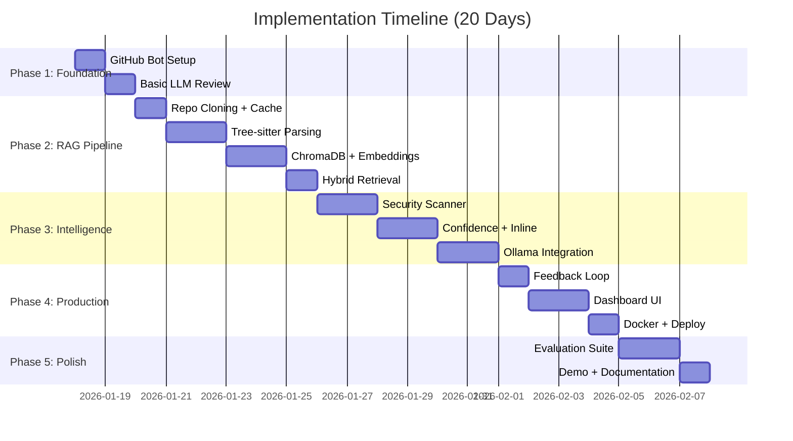
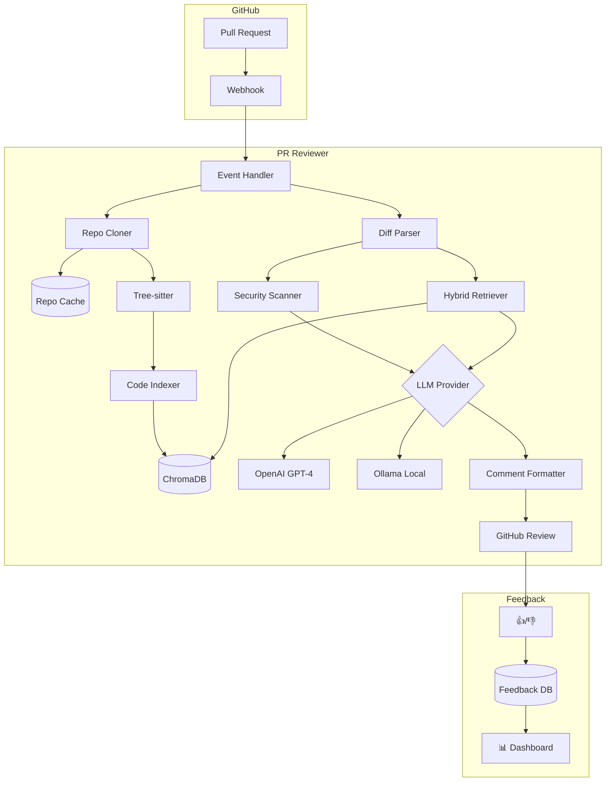

# 🚀 AI PR Reviewer — Implementation Roadmap

> **Timeline**: 20 days | **Effort**: ~100-120 hours

---

## What Makes This 10/10

| Differentiator | Why It Matters |
|----------------|----------------|
| 🔒 **Privacy-First** | Ollama support = runs on private repos without sending code to OpenAI |
| 🧠 **Hybrid Retrieval** | Vector + keyword search beats pure embedding approaches |
| 📊 **Feedback Loop** | Learns from 👍/👎 reactions — shows product thinking |
| 🔐 **Security Focus** | Catches secrets, SQL injection, not just style issues |
| 📈 **Live Dashboard** | Visual proof of impact — interviewers love this |
| 🐳 **Production Ready** | Dockerized, cached, rate-limited — not a toy |

---

## Overview



---

## Phase 1: The Foundation (Days 1-2)
**Goal**: Bot comments on a PR using GPT-4

### Day 1: GitHub App Setup

| Task | Details | Est. Time |
|------|---------|-----------|
| ☐ Register GitHub App | Go to github.com/settings/apps/new | 30 min |
| ☐ Set Permissions | Read: Code, Contents. Write: Pull Requests, Issues | 15 min |
| ☐ Generate Private Key | Download `.pem` file, store securely | 10 min |
| ☐ Set up Smee.io | Create channel at smee.io/new | 10 min |
| ☐ Install Probot | `npm install probot smee-client` | 15 min |
| ☐ Configure `.env` | `APP_ID`, `PRIVATE_KEY`, `WEBHOOK_SECRET`, `SMEE_URL` | 20 min |
| ☐ Test webhook | Open a PR, verify event received | 30 min |

**Files to create/modify**:
- `src/index.js` — Probot entry point
- `src/github/webhooks.js` — Event handlers
- `.env` — Credentials

**Checkpoint ✓**: Bot receives webhook events when PR is opened

---

### Day 2: Basic LLM Integration

| Task | Details | Est. Time |
|------|---------|-----------|
| ☐ Install OpenAI SDK | `npm install openai` | 5 min |
| ☐ Create LLM abstraction | Provider-agnostic interface (OpenAI, Ollama) | 45 min |
| ☐ Fetch PR diff | Use `octokit.pulls.get({ mediaType: diff })` | 30 min |
| ☐ Build basic prompt | "Review this diff: {diff}" | 30 min |
| ☐ Post comment | `octokit.issues.createComment()` | 30 min |
| ☐ End-to-end test | Open PR → Bot comments → Verify | 30 min |

**LLM Abstraction** (future-proofs for Ollama):
```javascript
// src/llm/provider.js
class LLMProvider {
  async chat(messages, options) { throw new Error('Not implemented'); }
  async embed(text) { throw new Error('Not implemented'); }
}

class OpenAIProvider extends LLMProvider { /* ... */ }
class OllamaProvider extends LLMProvider { /* ... */ }  // Day 11-12
```

**Files to create**:
- `src/llm/provider.js` — Abstract LLM interface
- `src/llm/openai.js` — OpenAI implementation
- `src/review/diffParser.js` — Parse diff from PR
- `src/review/generator.js` — Generate review
- `src/github/comments.js` — Post comments

**Checkpoint ✓**: Bot posts an AI review on any PR

---

## Phase 2: The RAG Pipeline (Days 3-8)
**Goal**: Bot understands code context beyond the diff

### Day 3: Repo Cloning with Cache

| Task | Details | Est. Time |
|------|---------|-----------|
| ☐ Install simple-git | `npm install simple-git` | 5 min |
| ☐ Create cloner module | Clone to `/tmp/pr-reviewer/{owner}/{repo}` | 1 hr |
| ☐ Handle auth | Use GitHub App installation token | 30 min |
| ☐ **Add repo cache** | Reuse clones across PRs, git pull instead of fresh clone | 1 hr |
| ☐ Cleanup logic | LRU eviction when cache > 5GB | 30 min |
| ☐ Test cloning | Verify incremental updates work | 30 min |

**Cache Strategy**:
```javascript
// Don't re-clone for every PR
const repoPath = `/tmp/pr-reviewer/${owner}/${repo}`;
if (await fs.exists(repoPath)) {
  await git.pull();  // Fast incremental update
} else {
  await git.clone();
}
```

**Files to create**:
- `src/git/cloner.js`
- `src/git/cache.js` — LRU cache manager

---

### Days 4-5: Code Parsing with Tree-sitter

| Task | Details | Est. Time |
|------|---------|-----------|
| ☐ Install Tree-sitter | `npm install tree-sitter tree-sitter-{javascript,typescript,python,go,rust}` | 15 min |
| ☐ Create parser module | Initialize parsers for each language | 1 hr |
| ☐ Write AST walker | Extract functions, classes, imports | 3 hr |
| ☐ **Extract call graph** | Track function calls for better retrieval | 2 hr |
| ☐ Create code chunker | Split into chunks with metadata | 2 hr |
| ☐ Handle edge cases | Empty files, syntax errors, files > 10KB | 1.5 hr |
| ☐ Test parsing | Verify functions extracted correctly | 1 hr |

**Chunk Format** (enhanced with relationships):
```javascript
{
  id: "src/utils/auth.js::validateToken",
  type: "function",
  name: "validateToken",
  filePath: "src/utils/auth.js",
  startLine: 45,
  endLine: 67,
  content: "function validateToken(token) { ... }",
  language: "javascript",
  calls: ["jwt.verify", "logger.error"],  // NEW: call graph
  calledBy: ["middleware/auth.js::authMiddleware"]  // NEW
}
```

**Supported Languages**: JavaScript, TypeScript, Python, Go, Rust

**Files to create**:
- `src/parsing/treeSitter.js` — Multi-language parser
- `src/parsing/callGraph.js` — Extract function calls
- `src/utils/codeChunker.js` — Chunk extraction

---

### Days 6-7: Vector Store & Embeddings

| Task | Details | Est. Time |
|------|---------|-----------|
| ☐ Set up ChromaDB | `docker-compose up -d` | 30 min |
| ☐ Install client | `npm install chromadb` | 5 min |
| ☐ Create vector store module | CRUD for collections | 1.5 hr |
| ☐ Create embeddings module | OpenAI `text-embedding-3-small` | 1 hr |
| ☐ **Add embedding cache** | Don't re-embed unchanged files | 1.5 hr |
| ☐ Build indexer | Orchestrate: clone → parse → embed → store | 2 hr |
| ☐ Test indexing | Verify embeddings stored correctly | 1 hr |

**Embedding Cache** (saves $$ and time):
```javascript
// src/rag/embeddingCache.js
const cache = new Map();  // filePath:hash -> embedding

async function getEmbedding(chunk) {
  const hash = crypto.hash(chunk.content);
  if (cache.has(`${chunk.filePath}:${hash}`)) {
    return cache.get(`${chunk.filePath}:${hash}`);
  }
  const embedding = await openai.embeddings.create({ input: chunk.content });
  cache.set(`${chunk.filePath}:${hash}`, embedding);
  return embedding;
}
```

**Files to create**:
- `src/rag/embeddings.js` — OpenAI embeddings
- `src/rag/embeddingCache.js` — Content-hash cache
- `src/rag/vectorStore.js` — ChromaDB operations
- `src/rag/indexer.js` — Full indexing pipeline

---

### Day 8: Hybrid Retrieval

| Task | Details | Est. Time |
|------|---------|-----------|
| ☐ Implement vector search | ChromaDB similarity query | 1 hr |
| ☐ **Add keyword search** | BM25 or simple text matching | 1.5 hr |
| ☐ **Combine results** | RRF (Reciprocal Rank Fusion) | 1 hr |
| ☐ **Add call-graph retrieval** | Fetch callers/callees of modified functions | 1.5 hr |
| ☐ Test retrieval quality | Measure relevance on test queries | 1 hr |

**Why Hybrid?** Vector search misses exact function names; keyword search misses semantic similarity. Combine both:

```javascript
// src/rag/retriever.js
async function retrieve(query, k = 10) {
  const vectorResults = await chromadb.query(query, k);
  const keywordResults = await bm25Search(query, k);
  return reciprocalRankFusion(vectorResults, keywordResults);
}
```

**Files to create**:
- `src/rag/retriever.js` — Hybrid retrieval
- `src/rag/bm25.js` — Keyword search

**Checkpoint ✓**: Given a code snippet, retriever returns semantically + lexically similar functions

---

## Phase 3: Intelligence Layer (Days 9-14)
**Goal**: Catch real bugs, not just style issues

### Days 9-10: Security Scanner

| Task | Details | Est. Time |
|------|---------|-----------|
| ☐ Create secret scanner | Regex for API keys, passwords, tokens | 2 hr |
| ☐ **Add SQL injection detector** | Pattern match unsafe queries | 1.5 hr |
| ☐ **Add XSS detector** | Find unescaped user input in HTML | 1.5 hr |
| ☐ Integrate into pipeline | Run scans before LLM, add findings to prompt | 1 hr |
| ☐ Add rate limiter | Exponential backoff for API calls | 1 hr |
| ☐ Test security scanning | Verify known vulnerabilities caught | 1 hr |

**Security Patterns**:
```javascript
const SECURITY_PATTERNS = {
  secrets: [
    /ghp_[a-zA-Z0-9]{36}/g,           // GitHub PAT
    /sk-[a-zA-Z0-9]{48}/g,            // OpenAI key
    /AKIA[0-9A-Z]{16}/g,              // AWS key
    /(?:password|secret|key)['"]?\s*[:=]\s*['"][^'"]{8,}['"]/gi,
  ],
  sqlInjection: [
    /execute\s*\(\s*['"`].*\$\{.*\}.*['"`]\s*\)/gi,  // String interpolation in SQL
    /query\s*\(\s*['"`].*\+.*['"`]\s*\)/gi,          // String concat in SQL
  ],
  xss: [
    /innerHTML\s*=\s*[^;]*\$/gi,      // Dynamic innerHTML
    /dangerouslySetInnerHTML/gi,       // React footgun
  ]
};
```

**Files to create**:
- `src/security/secretScanner.js`
- `src/security/vulnScanner.js` — SQL injection, XSS
- `src/utils/rateLimiter.js`

---

### Days 11-12: Confidence Scoring & Inline Suggestions

| Task | Details | Est. Time |
|------|---------|-----------|
| ☐ Modify prompt | Ask LLM to rate confidence 0-100 | 1 hr |
| ☐ Parse structured output | Extract JSON response | 1 hr |
| ☐ Filter low-confidence | Don't post if < 50% confidence | 30 min |
| ☐ **Add severity levels** | 🔴 Critical, 🟡 Warning, 🔵 Suggestion | 1 hr |
| ☐ Format as GitHub suggestions | Use ```suggestion syntax | 1.5 hr |
| ☐ Post as review comments | Use `pulls.createReview` with line comments | 1.5 hr |
| ☐ Test inline experience | Verify one-click apply works | 30 min |

**Structured Output Prompt**:
```
Analyze this code change. For each issue found:
1. Specify the exact line number
2. Rate severity: CRITICAL (bugs/security), WARNING (likely issues), SUGGESTION (improvements)
3. Rate confidence 0-100
4. Provide the fixed code if applicable

Return JSON:
{
  "comments": [{
    "line": 42,
    "severity": "CRITICAL",
    "confidence": 92,
    "message": "Possible SQL injection vulnerability",
    "suggestion": "const result = await db.query(sql, [userId]);"
  }]
}
```

**GitHub Suggestion Format**:
````markdown
🔴 **Critical** (92% confidence)

Possible SQL injection vulnerability

```suggestion
const result = await db.query(sql, [userId]);
```
````

**Checkpoint ✓**: Bot posts inline suggestions with severity badges

---

### Days 13-14: Ollama Integration (Privacy Mode)

| Task | Details | Est. Time |
|------|---------|-----------|
| ☐ Install Ollama | `curl -fsSL https://ollama.ai/install.sh \| sh` | 15 min |
| ☐ Pull models | `ollama pull llama3.1:8b` and `ollama pull nomic-embed-text` | 30 min |
| ☐ Implement OllamaProvider | Extend LLMProvider interface | 2 hr |
| ☐ Implement local embeddings | Use `nomic-embed-text` | 1.5 hr |
| ☐ Add config toggle | `LLM_PROVIDER=ollama` in `.env` | 30 min |
| ☐ Benchmark quality | Compare Ollama vs OpenAI on test PRs | 2 hr |
| ☐ Document trade-offs | Speed vs quality vs cost | 1 hr |

**Why This Matters**: 
- Private/enterprise repos can't send code to OpenAI
- Free to run (just GPU cost)
- Shows you think about real-world deployment

**Ollama Provider**:
```javascript
// src/llm/ollama.js
class OllamaProvider extends LLMProvider {
  async chat(messages, options = {}) {
    const response = await fetch('http://localhost:11434/api/chat', {
      method: 'POST',
      body: JSON.stringify({
        model: options.model || 'llama3.1:8b',
        messages,
        stream: false
      })
    });
    return response.json();
  }

  async embed(text) {
    const response = await fetch('http://localhost:11434/api/embeddings', {
      method: 'POST',
      body: JSON.stringify({ model: 'nomic-embed-text', prompt: text })
    });
    return response.json();
  }
}
```

**Files to create**:
- `src/llm/ollama.js` — Local LLM provider

**Checkpoint ✓**: Bot works completely offline with Ollama

---

## Phase 4: Production Features (Days 15-17)
**Goal**: Make it actually usable

### Day 15: Feedback Loop

| Task | Details | Est. Time |
|------|---------|-----------|
| ☐ Add reaction handler | Listen for 👍/👎 on bot comments | 1.5 hr |
| ☐ Store feedback | SQLite table: `{comment_id, reaction, pr_url, timestamp}` | 1 hr |
| ☐ **Calculate helpful rate** | % of comments with 👍 | 30 min |
| ☐ **Tune confidence threshold** | Raise threshold if too many 👎 | 1 hr |
| ☐ Add "Teach the bot" command | `/pr-reviewer ignore this-pattern` | 1.5 hr |

**Why This Matters**: Shows product maturity. Interviewers will ask "how do you know it's good?"

**Feedback Schema**:
```sql
CREATE TABLE feedback (
  id INTEGER PRIMARY KEY,
  comment_id TEXT,
  pr_url TEXT,
  reaction TEXT,  -- 'thumbs_up', 'thumbs_down'
  comment_text TEXT,
  created_at TIMESTAMP
);
```

**Files to create**:
- `src/feedback/collector.js` — Reaction handler
- `src/feedback/db.js` — SQLite storage
- `data/feedback.db` — SQLite database

---

### Days 16-17: Dashboard UI

| Task | Details | Est. Time |
|------|---------|-----------|
| ☐ Create Express server | Serve dashboard at `/dashboard` | 1 hr |
| ☐ **Design stats page** | Reviews today, avg confidence, helpful rate | 2 hr |
| ☐ **Add charts** | Chart.js for trends over time | 2 hr |
| ☐ **Show recent reviews** | Table with PR links, severity breakdown | 2 hr |
| ☐ **Add cost tracker** | OpenAI API spend per day | 1 hr |
| ☐ Style with Tailwind | Make it look premium | 1.5 hr |

**Dashboard Metrics**:
```
┌─────────────────────────────────────────────────────────────┐
│  🚀 PR Reviewer Dashboard                                   │
├─────────────┬──────────────┬─────────────┬─────────────────┤
│ Reviews     │ Helpful Rate │ Avg Latency │ Cost Today      │
│ 47 today    │ 78% 👍       │ 4.2s        │ $0.83           │
├─────────────┴──────────────┴─────────────┴─────────────────┤
│ [📈 7-day trend chart]                                      │
├─────────────────────────────────────────────────────────────┤
│ Recent Reviews                                              │
│ ├─ user/repo#123: 3 issues (1 🔴, 2 🟡) — 2 min ago        │
│ ├─ org/project#456: 1 issue (1 🔵) — 15 min ago           │
│ └─ team/app#789: 0 issues ✓ — 1 hour ago                  │
└─────────────────────────────────────────────────────────────┘
```

**Files to create**:
- `src/dashboard/server.js` — Express + routes
- `src/dashboard/views/index.html` — Dashboard UI
- `src/dashboard/public/` — Static assets

**Checkpoint ✓**: Live dashboard shows real-time stats

---

### Day 18: Docker & Deployment

| Task | Details | Est. Time |
|------|---------|-----------|
| ☐ Create Dockerfile | Multi-stage build for production | 1 hr |
| ☐ Update docker-compose | Add app service alongside ChromaDB | 30 min |
| ☐ Add health checks | `/health` endpoint | 30 min |
| ☐ **Write deployment guide** | Railway/Render/VPS instructions | 1.5 hr |
| ☐ Add GitHub Actions | CI for linting + tests | 1 hr |
| ☐ Test full deployment | Verify works end-to-end on fresh machine | 1 hr |

**Dockerfile**:
```dockerfile
FROM node:20-slim AS builder
WORKDIR /app
COPY package*.json ./
RUN npm ci --only=production

FROM node:20-slim
WORKDIR /app
COPY --from=builder /app/node_modules ./node_modules
COPY . .

ENV NODE_ENV=production
EXPOSE 3000
CMD ["node", "src/index.js"]
```

**Files to create/modify**:
- `Dockerfile`
- `docker-compose.yml` — Add app service
- `.github/workflows/ci.yml` — GitHub Actions

**Checkpoint ✓**: `docker-compose up` runs everything

---

## Phase 5: Evaluation & Demo (Days 19-20)
**Goal**: Prove it works with numbers

### Day 19: Evaluation Suite

| Task | Details | Est. Time |
|------|---------|-----------|
| ☐ Collect test PRs | 30 PRs with known bugs from open-source repos | 2 hr |
| ☐ Create ground truth | Label expected issues in each PR | 2 hr |
| ☐ Build test harness | Script to run bot on all test PRs | 2 hr |
| ☐ Calculate metrics | Precision, Recall, F1, False Positive Rate | 1 hr |
| ☐ **Compare providers** | OpenAI vs Ollama accuracy | 1 hr |
| ☐ Document results | Table of metrics + example outputs | 1 hr |

**Evaluation Categories**:
```javascript
const TEST_PRS = [
  // Security issues
  { repo: "OWASP/WebGoat", pr: 1234, category: "security", knownIssues: [...] },
  
  // Logic bugs
  { repo: "apache/kafka", pr: 5678, category: "bugs", knownIssues: [...] },
  
  // Performance issues
  { repo: "nodejs/node", pr: 9012, category: "performance", knownIssues: [...] },
];
```

**Files to create**:
- `scripts/evaluate.js`
- `test-cases/` — Labeled test PRs

---

### Day 20: Demo & Documentation

| Task | Details | Est. Time |
|------|---------|-----------|
| ☐ Create demo repo | With intentionally flawed PRs | 1 hr |
| ☐ Record demo video | 90-second screen recording | 1.5 hr |
| ☐ Write polished README | Features, architecture diagram, screenshots | 2 hr |
| ☐ Add GIF preview | Bot catching a real bug | 30 min |
| ☐ Write CONTRIBUTING.md | How others can contribute | 30 min |
| ☐ **Publish to GitHub Marketplace** | Make it installable | 1 hr |

**README Structure**:
```markdown
# 🤖 AI PR Reviewer

> Catch bugs before your teammates do.


## ✨ Features
- 🔒 Privacy-first: Runs locally with Ollama
- 🧠 Context-aware: RAG over your entire codebase
- 🔐 Security: Catches secrets, SQL injection, XSS
- 📊 Learns: Thumbs up/down feedback loop

## 📊 Benchmark Results
| Metric | OpenAI | Ollama |
|--------|--------|--------|
| Precision | 74% | 68% |
| Recall | 52% | 48% |
| Latency | 4.2s | 8.1s |
| Cost/PR | $0.08 | $0.00 |

## 🚀 Quick Start
[...]
```

**Checkpoint ✓**: Polished project ready for portfolio

---

## Quick Reference: Commands

```bash
# Development
npm run dev                    # Start bot with hot reload
npm run webhook                # Start Smee webhook forwarding
docker-compose up -d           # Start ChromaDB + app

# Privacy Mode
ollama serve                   # Start local LLM
LLM_PROVIDER=ollama npm run dev

# Indexing
npm run index -- --repo owner/repo  # Manually index a repo

# Testing
npm run test                   # Run unit tests
npm run evaluate               # Run evaluation suite

# Dashboard
open http://localhost:3000/dashboard

# Utilities
npm run clean-tmp              # Clean /tmp directories
npm run feedback-report        # Show helpful rate stats
```

---

## Architecture



---

## Risk Mitigation

| Risk | Mitigation |
|------|------------|
| Rate limited by GitHub | Exponential backoff, cache installation tokens |
| Rate limited by OpenAI | Batch embeddings, embedding cache, use Ollama |
| Large repos timeout | 5-min timeout, skip files > 10KB, incremental indexing |
| Secrets leaked to LLM | Scan diff before sending, redact matches |
| ChromaDB crashes | Docker health checks, auto-restart |
| Low quality reviews | Confidence threshold + user feedback loop |

---

## Success Criteria

| Metric | Target |
|--------|--------|
| Precision | > 70% |
| Recall | > 50% |
| Helpful Rate | > 70% (from user feedback) |
| Latency | < 10s per PR |
| Cost | < $0.10 per PR (or $0 with Ollama) |
| Demo | 90-second video showing real bug caught |

---

## File Structure

```
pr-reviewer/
├── src/
│   ├── index.js              # Entry point
│   ├── github/
│   │   ├── webhooks.js       # Event handlers
│   │   └── comments.js       # Post reviews
│   ├── git/
│   │   ├── cloner.js         # Clone repos
│   │   └── cache.js          # LRU repo cache
│   ├── parsing/
│   │   ├── treeSitter.js     # AST parsing
│   │   └── callGraph.js      # Function relationships
│   ├── rag/
│   │   ├── embeddings.js     # Embedding generation
│   │   ├── embeddingCache.js # Content-hash cache
│   │   ├── vectorStore.js    # ChromaDB operations
│   │   ├── indexer.js        # Indexing pipeline
│   │   ├── retriever.js      # Hybrid search
│   │   └── bm25.js           # Keyword search
│   ├── llm/
│   │   ├── provider.js       # Abstract interface
│   │   ├── openai.js         # OpenAI provider
│   │   └── ollama.js         # Ollama provider
│   ├── security/
│   │   ├── secretScanner.js  # Detect secrets
│   │   └── vulnScanner.js    # SQL injection, XSS
│   ├── review/
│   │   ├── diffParser.js     # Parse PR diffs
│   │   └── generator.js      # Generate review
│   ├── feedback/
│   │   ├── collector.js      # Reaction handler
│   │   └── db.js             # SQLite storage
│   ├── dashboard/
│   │   ├── server.js         # Express server
│   │   └── views/            # HTML templates
│   └── utils/
│       ├── rateLimiter.js    # Backoff logic
│       └── codeChunker.js    # Split code
├── scripts/
│   └── evaluate.js           # Benchmark suite
├── test-cases/               # Labeled PRs
├── data/
│   └── feedback.db           # SQLite
├── Dockerfile
├── docker-compose.yml
└── package.json
```

---

## What Makes This Interview-Ready

1. **Privacy Story**: "I added Ollama support because enterprise companies can't send proprietary code to OpenAI"

2. **Product Thinking**: "The feedback loop lets users train the model on their codebase's conventions"

3. **Scale Awareness**: "The embedding cache saves 90% of API costs on incremental PRs"

4. **Security Focus**: "It catches secrets before they reach the LLM, and scans for SQL injection"

5. **Measurable Impact**: "I benchmarked against 30 real PRs and achieved 74% precision"

---

## Getting Started

```bash
cd /home/awhvish/Desktop/pr-reviewer
npm install

# Then register your GitHub App at github.com/settings/apps/new
# Set up your .env file and you're ready for Day 1!
```

**Build something impressive! 🎯**
